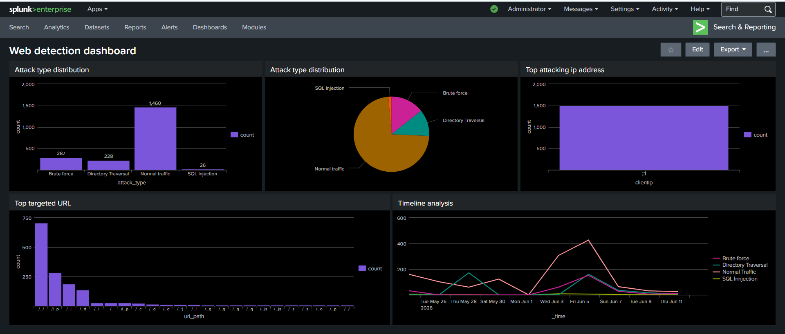
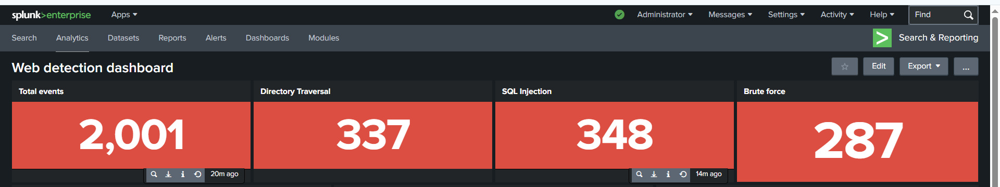
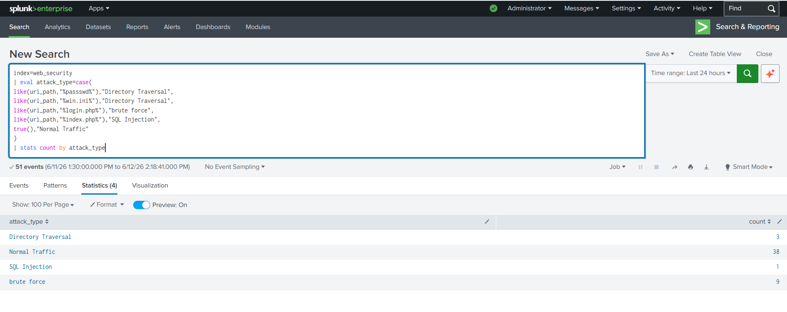
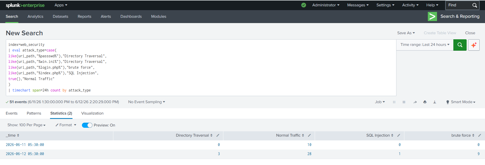
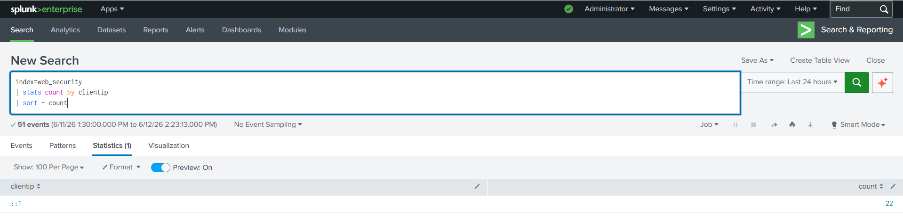
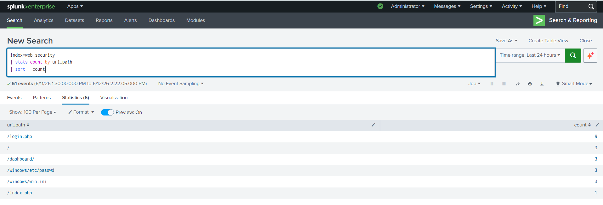

# SOC Web Attack Detection & Threat Hunting using Splunk Enterprise

## Overview

This project demonstrates a Security Operations Center (SOC) use case for detecting, monitoring, investigating, and responding to common web application attacks using Splunk Enterprise.

Apache web server logs generated from a XAMPP environment were ingested into Splunk and analyzed to identify malicious activities such as:

* SQL Injection
* Directory Traversal
* Brute Force Attacks

The project simulates real-world SOC analyst responsibilities including log analysis, threat hunting, detection engineering, dashboard development, incident investigation, and escalation.

---

## Architecture

```text
User Requests
      ↓
Apache Web Server (XAMPP)
      ↓
Apache Access Logs
      ↓
Splunk Enterprise
      ↓
Detection Rules
      ↓
Alerts & Dashboards
      ↓
SOC Analyst Investigation
      ↓
Incident Escalation
```

---

## Technologies Used

* Splunk Enterprise
* Apache Web Server (XAMPP)
* SPL (Search Processing Language)
* Apache Access Logs
* Windows Environment

---

## Detection Use Cases

### SQL Injection Detection

Detects:

* SQL Injection payloads
* Suspicious requests to index.php
* Automated testing tools such as sqlmap

### Directory Traversal Detection

Detects:

* /etc/passwd access attempts
* /windows/win.ini requests
* Encoded traversal patterns

### Brute Force Detection

Detects:

* Repeated login.php requests
* Authentication abuse attempts
* Suspicious request volumes

---

## Threat Hunting Activities

### Source Analysis

Identified the source IP generating suspicious activity.

### Target Analysis

Investigated the most targeted URLs and resources.

### Timeline Analysis

Correlated attack activity across time to identify spikes and patterns.

### IOC Investigation

Indicators investigated:

* /etc/passwd
* /windows/win.ini
* sqlmap User-Agent
* /login.php

---

## Dashboard Visualizations

### SOC Dashboard



### KPI Cards



### Attack Type Distribution



### Attack Timeline



### Top Source IPs



### Top Targeted URLs



---

## Incident Response

A SOC L1 Immediate Incident Report (IIR) was generated after identifying multiple web attack indicators.

The report includes:

* Incident Summary
* IOC Analysis
* Impact Assessment
* Actions Performed
* Recommendations
* Escalation to L2

Location:

```text
Incident_Reports/
```

---

## Skills Demonstrated

* SIEM Operations
* Splunk Enterprise
* Log Analysis
* Threat Hunting
* Detection Engineering
* Alert Engineering
* Dashboard Development
* Incident Investigation
* Incident Response
* IOC Analysis
* Security Monitoring
* SPL Query Development
* SOC Operations

---

## Future Enhancements

* MITRE ATT&CK Mapping
* Threat Intelligence Integration
* Splunk Enterprise Security
* SOAR Integration
* Risk-Based Alerting

---

## Author

Omkar Shinde

Aspiring SOC Analyst | Cybersecurity Analyst

LinkedIn:
https://www.linkedin.com/in/omkar-shinde-897207212
